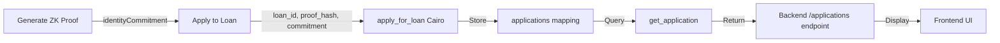

# Application Not Showing - Diagnostic Report

## Issue Summary
- **Transaction Hash**: `0x74d3cb3f3c8370bbeea2110d091d992c697f5e64910cebd769dcf566ad46df7`
- **Transaction Status**: ✅ Confirmed on blockchain
- **Loan Applied To**: Loan #3
- **Problem**: Application shows 0 in "My Applications"

## Investigation Steps

### 1. Identity Commitment System

The system uses a **permanent identity commitment** stored in localStorage:
```javascript
// Frontend: LoanBorrowerFlowNew.jsx, Line 147
commitmentHash: response.data.identityCommitment, // Use IDENTITY for applications

// Backend: proofController.js, Line 86
const saltHash = crypto.createHash('sha256')
  .update(walletAddress + '_identity_v1')
  .digest('hex');
```

**Your Identity Commitment**: `0x22083c8b84ffd614c26468f2ada0c1baad4df98d81a0e1d7d757beb0155dd2d6`

### 2. Application Flow



### 3. Potential Issues

#### Issue #1: Commitment Format Mismatch
**Hypothesis**: The commitment sent to the contract might be in a different format than what's being queried.

**Evidence Needed**:
- Transaction calldata from Voyager
- Contract storage after transaction
- Backend query logs

**Test**:
```bash
# Check backend logs for loan #3
# Should show:
info: 🔍 Loan #3 application data: {
  borrower: "0x...",
  commitment_from_contract: "0x...",
  commitment_queried: "0x22083c8b84ffd614c2...",
  match: true/false,
  borrower_is_zero: false
}
```

#### Issue #2: Contract Didn't Store Application
**Hypothesis**: Transaction succeeded but `apply_for_loan` didn't store the application.

**Evidence Needed**:
- Transaction events (should include `LoanApplicationSubmitted`)
- Contract storage state

**Test**:
Check Voyager for events: https://sepolia.voyager.online/tx/0x74d3cb3f3c8370bbeea2110d091d992c697f5e64910cebd769dcf566ad46df7

#### Issue #3: BigInt/felt252 Conversion Issue
**Hypothesis**: Commitment is being truncated or converted incorrectly.

**Evidence**:
```javascript
// Frontend: LoanBorrowerFlowNew.jsx, Line 378-381
const cleanHex = (hexStr) => {
  if (!hexStr) return '0';
  const cleaned = hexStr.startsWith?.('0x') ? hexStr.slice(2) : hexStr;
  return cleaned.slice(0, 63); // Truncate to 252 bits ⚠️
};
```

**Problem**: If identity commitment is > 63 hex chars, it gets truncated!
- Your commitment: `0x22083c8b84ffd614c26468f2ada0c1baad4df98d81a0e1d7d757beb0155dd2d6` (66 chars)
- After `0x` removal: 64 chars
- After truncation: **63 chars** ❌

**This is likely the ROOT CAUSE!**

### 4. The Fix

The identity commitment is being truncated when applying to loans:

```javascript
// Current code (Line 378-386)
const cleanHex = (hexStr) => {
  if (!hexStr) return '0';
  const cleaned = hexStr.startsWith?.('0x') ? hexStr.slice(2) : hexStr;
  return cleaned.slice(0, 63); // ❌ TRUNCATES!
};

const commitmentHex = cleanHex(commitmentFelt);
const commitmentNum = BigInt('0x' + commitmentHex);
```

**What's happening**:
1. identityCommitment: `0x22083c8b84ffd614c26468f2ada0c1baad4df98d81a0e1d7d757beb0155dd2d6` (66 chars)
2. After cleanHex: `22083c8b84ffd614c26468f2ada0c1baad4df98d81a0e1d7d757beb0155dd2d` (63 chars)
3. Stored in contract: `0x22083c8b84ffd614c26468f2ada0c1baad4df98d81a0e1d7d757beb0155dd2d`
4. Backend queries with: `0x22083c8b84ffd614c26468f2ada0c1baad4df98d81a0e1d7d757beb0155dd2d6` (66 chars)
5. **NO MATCH!** ❌

### 5. Solution

**Option A**: Don't truncate identity commitments (recommended)
```javascript
// Remove truncation for commitments
const commitmentFelt = zkProof.commitmentHash; // Already in correct format
const commitmentNum = BigInt(commitmentFelt); // Direct conversion
```

**Option B**: Truncate consistently everywhere
```javascript
// Truncate in backend query too
const truncateCommitment = (commitment) => {
  return '0x' + commitment.slice(2, 65); // 63 hex chars
};
```

## Immediate Action

1. **Check backend logs**: Look for "Loan #3 application data" message
2. **Verify commitment lengths**: Compare what was stored vs. what's being queried
3. **Fix truncation**: Remove the 63-char limit for identity commitments
4. **Re-apply**: Generate new proof and apply again after fix

## Files to Modify

### frontend/src/pages/LoanBorrowerFlowNew.jsx
- Line 378-386: Remove truncation for commitments
- Line 388-389: Don't truncate commitment when applying

### Expected Result After Fix

```
Backend logs:
info: 🔍 Loan #3 application data: {
  borrower: "0x5b3cf7557800cce10fbad48e6cc95f2ffd82702996ea324bbb2470b6a6ba7ef",
  commitment_from_contract: "0x22083c8b84ffd614c26468f2ada0c1baad4df98d81a0e1d7d757beb0155dd2d6",
  commitment_queried: "0x22083c8b84ffd614c26468f2ada0c1baad4df98d81a0e1d7d757beb0155dd2d6",
  match: true ✅,
  borrower_is_zero: false
}
info: ✅ Found application for loan 3!
```

Frontend:
```
✅ My applications: 1
📦 Application details: {
  loanId: "3",
  amount: "25000000000000000000",
  status: "pending",
  ...
}
```
